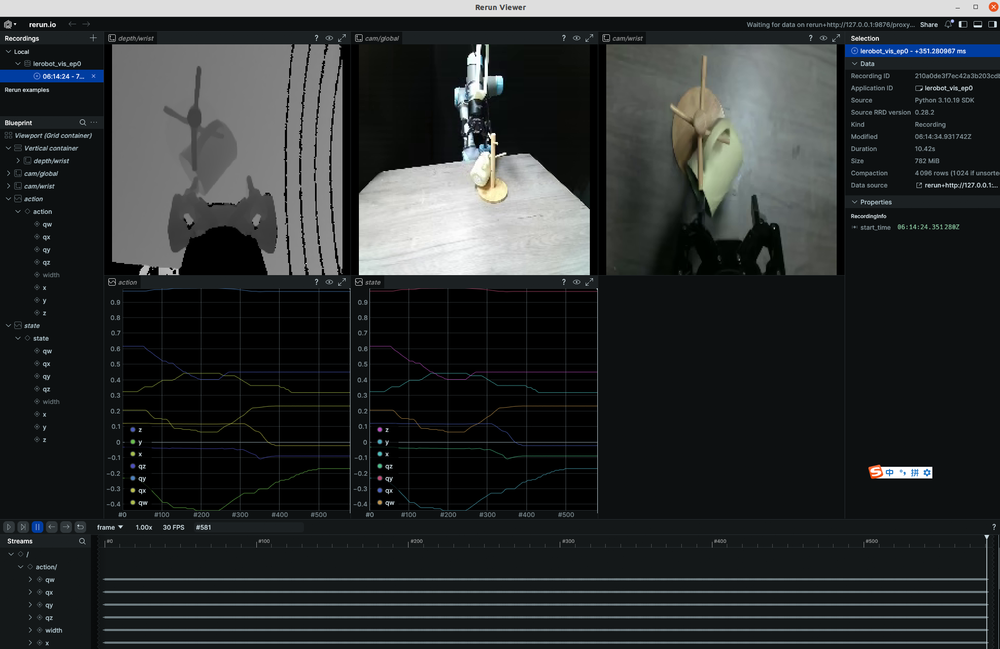

## UR_Recording

```bash
source ~/ExDex/data_collection/franka_ws/devel/setup.bash
roslaunch realsense2_camera l515_camera_l_myc.launch
roslaunch azure_kinect_ros_driver kinect_rgbd.launch
```

Record data in lerobot dataset format
```bash
python lerobot_ur_recording.py
```

Visualize data in lerobot dataset format use rerun.io
```bash
python lerobot_vis_dataset_quat.py
```

